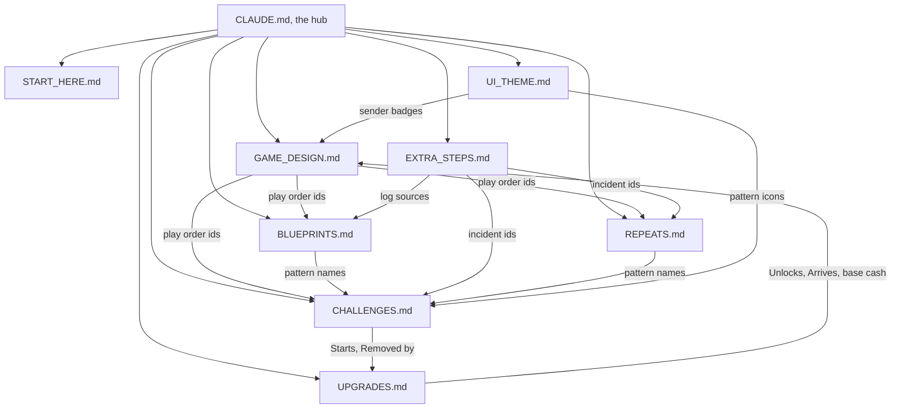

# Zero to a Billion

A browser game that teaches real system design. The player is the first engineer at Blip, a made-up app, and grows it from 0 to 1 billion users by fixing incidents. The whole game looks like an early 2000s computer desktop.

This file is the hub. It holds no game content of its own. It says where every fact lives, how the files depend on each other, and what to update when something changes. Read it first, every session.

## The map

| File | What it owns | Read it before |
|---|---|---|
| [docs/START_HERE.md](docs/START_HERE.md) | Tech stack, folder layout, build order, the message that starts each milestone | Starting any milestone |
| [docs/GAME_DESIGN.md](docs/GAME_DESIGN.md) | The rules: cast, stages, play order, how things arrive, all three incident flows, extra steps, users, stars, money, hints, tutorial, win screen | Writing any game logic |
| [docs/CHALLENGES.md](docs/CHALLENGES.md) | Every new incident: text, options, answers, hints, users gained, Pattern Book entries | Building new incidents or their data file |
| [docs/REPEATS.md](docs/REPEATS.md) | Every repeat incident, and the list of everyday patterns | Building repeats, pips or refreshers |
| [docs/BLUEPRINTS.md](docs/BLUEPRINTS.md) | Every Build incident: goal, tray, decoys, solution, wrong moves. The toolbox: every part and the real tool names | Building Blueprint, Build incidents or anything that shows a tool name |
| [docs/EXTRA_STEPS.md](docs/EXTRA_STEPS.md) | Every Triage step (log lines) and Tune step (dial, waves) | Building Terminal, SysDash or either extra step |
| [docs/UPGRADES.md](docs/UPGRADES.md) | Every Shop item: the price rule, prices, users gained, effects, request emails | Building the Shop, request emails or any upgrade effect |
| [docs/UI_THEME.md](docs/UI_THEME.md) | The look: desktop, windows, alerts, sender badges, the three work apps, pattern icons, colours, readability rules | Building anything on screen |
| PROGRESS.md | What is built, what is next, decisions made, and a change log | Starting any session |
| [scripts/check-docs.mjs](scripts/check-docs.mjs) | The check that proves the docs still agree with each other | Committing any change to the docs |

Do not read every file every time. Read this file, then only the files the task needs.

## How the files connect

An arrow means "points to". The file at the start of the arrow uses names, ids or numbers that are defined in the file at the end.



The links, in words:

- **Play order.** The play order table in GAME_DESIGN.md lists every incident id. Each id must be written in CHALLENGES.md, REPEATS.md or BLUEPRINTS.md, with the same title, stage and "Needs".
- **Feature gates.** An incident's "Starts" line in CHALLENGES.md names a must-have feature in UPGRADES.md. That feature's "Unlocks incident" must name the same incident.
- **Upgrade effects.** A "Removed by" line in CHALLENGES.md names a Shop item. That item's effect text must name the incident.
- **Patterns.** Pattern names come from the "Pattern Book" lines in CHALLENGES.md. REPEATS.md and the icon table in UI_THEME.md must use exactly the same names.
- **Repeats.** A repeat's wrong cards must be patterns the player has already learned at that point in the play order.
- **Builds.** Every part in a Build's tray must be in the toolbox in BLUEPRINTS.md. A part tied to a pattern can only be used after that pattern is learned. The "Practises" line uses Pattern Book names.
- **Tools.** Every pattern must have familiar tools in the toolbox, through a part or through the table for patterns with no part.
- **Extra steps.** Each Triage and Tune step in EXTRA_STEPS.md names an incident id and title that exist. Each log source must stand for something in the toolbox.
- **People.** Anyone who sends an alert, incident email or request email must be in the cast table in GAME_DESIGN.md, and must have a sender badge in UI_THEME.md.
- **Prices.** Every price in UPGRADES.md comes from the price rule there and the base cash per stage in GAME_DESIGN.md.
- **Users.** "Users gained" across all incidents and must-have features must add up to exactly 1 billion. The optional totals written in GAME_DESIGN.md must match UPGRADES.md.
- **Request emails.** Each "Arrives" in UPGRADES.md names a point in the play order.

## One fact, one home

Every fact is written in one file only. Other files point to it and never copy it.

| Fact | Its home |
|---|---|
| The order incidents are played in | Play order table in GAME_DESIGN.md |
| An incident's text, options, answers, hints, users gained and how it arrives | CHALLENGES.md or REPEATS.md |
| Pattern names and "Use this when" lines | "Pattern Book" lines in CHALLENGES.md |
| Which patterns come back, and where | Everyday patterns table in REPEATS.md |
| A Build's goal, tray, decoys, solution and wrong moves | BLUEPRINTS.md |
| Parts and the real tool names shown for them | The toolbox in BLUEPRINTS.md |
| Triage log lines, Tune dials and waves | EXTRA_STEPS.md |
| What extra steps pay, and how every flow runs | GAME_DESIGN.md |
| Prices, users gained from items, effects, request emails | UPGRADES.md |
| Base cash per stage, star multipliers, penalties, the loan rule | GAME_DESIGN.md |
| Who can send things, and their roles | Cast table in GAME_DESIGN.md |
| Tutorial steps, tips and the How to Play text | GAME_DESIGN.md |
| Colours, fonts, sizes, word limits, icons | UI_THEME.md |
| Tech choices, folder layout, milestones | START_HERE.md |
| Ideas that are not being built yet | "Ideas for later" in GAME_DESIGN.md |

If you need a fact and cannot find its home, ask. Do not write it in a second place.

## When you change something

| If you | Also update |
|---|---|
| Add, remove or reorder an incident | The play order table. "Users gained" so the total is still 1 billion. The counts written in GAME_DESIGN.md, START_HERE.md and the file's own title |
| Add a new incident that teaches a pattern | Its "Pattern Book" line. An icon for it in UI_THEME.md |
| Add a repeat | The everyday patterns table in REPEATS.md. Its nudge must name the earlier incidents with the same pattern |
| Add a Build | Its parts in the toolbox. A row in the play order. A decoy and a wrong move for it. "Users gained" so the total is still 1 billion |
| Add a part or a tool name | The toolbox in BLUEPRINTS.md only. Text names, never logos |
| Add a Triage or Tune step | The incident it names must exist. New log sources go in the log sources table. The counts written in GAME_DESIGN.md and START_HERE.md |
| Add or reprice a Shop item | Price from the price rule. A request email row, unless it is "Your setup". The item count in UPGRADES.md and START_HERE.md. The optional user totals in GAME_DESIGN.md if it brings users |
| Change base cash, star multipliers or price points | Every price in UPGRADES.md. The money examples in GAME_DESIGN.md |
| Add a person who sends things | The cast table in GAME_DESIGN.md. A sender badge in UI_THEME.md |
| Change a colour | Check it still passes the contrast rule in UI_THEME.md |
| Add a new doc | A row in the map above. A row in the files table in START_HERE.md. Its links in "How the files connect" |
| Create, move or rename a code file | The code map below |

Then run the check:

```
node scripts/check-docs.mjs
```

It must print "0 problems" before you commit. If it reports a problem, fix the docs. Do not edit the script to make a problem go away. If you add a new kind of link between files, add a check for it to the script in the same commit.

## Rules for working here

1. The docs are the source of truth. Code copies from the docs, never the other way round. If code and docs disagree, the docs win.
2. To change the game: change the doc first, run the check, then change the data file and the code.
3. Never invent or change incidents, answers, hints, emails, prices or rewards unless I ask. Copy them from the docs into typed data files.
4. If something is missing, unclear, or two files disagree, stop and ask. Do not guess.
5. Game content lives in data files. Game logic must never hard-code a single incident, email or upgrade.
6. Build one milestone at a time, in the order in START_HERE.md. Stop after each one so I can play it.
7. Keep PROGRESS.md short and current: what is done, what is next, decisions made. Add a line to its change log for every change to the docs or the code.
8. All words shown on screen come from the docs. If you need new on-screen text, keep it under 12 words and list it in PROGRESS.md for me to check.
9. Write docs and on-screen text in plain words and short sentences, with plain punctuation. The readability rules in UI_THEME.md apply to everything the player reads.
10. Changes to the docs are committed straight to main once the check prints "0 problems". I have agreed to this, so there is no need to ask each time.

## Growing the game

- **New content** goes into the file that owns that kind of content. Follow the "How to read" section at the top of that file so the format stays the same.
- **New kinds of content** (a new channel, a new game mode, sound, a new screen) get their own file in the docs folder, plus the rows listed under "Add a new doc".
- **When a file gets too long to read in one go**, split it by stage into a folder with the same name, and update the map.
- **Ideas** go in "Ideas for later" first. They move into the other files only when I decide to build them.
- **Decisions and their reasons** go in PROGRESS.md, so nobody has to guess later why something is the way it is.

## Code map

This links each doc to the code that copies from it. None of the code exists yet. Change "Planned" to "Built" when a file is created, and keep the paths current.

| Doc | Code that copies from it | Status |
|---|---|---|
| docs/CHALLENGES.md | `data/challenges.ts` | Planned |
| docs/REPEATS.md | `data/repeats.ts` | Planned |
| docs/BLUEPRINTS.md | `data/blueprints.ts` | Planned |
| docs/EXTRA_STEPS.md | `data/extraSteps.ts` | Planned |
| docs/UPGRADES.md | `data/upgrades.ts`, `data/emails.ts` | Planned |
| docs/GAME_DESIGN.md | `data/stages.ts`, `data/playOrder.ts`, `game/reducer.ts` | Planned |
| docs/UI_THEME.md | `components/desktop`, `components/windows` | Planned |

## Commands

| Command | What it does |
|---|---|
| `node scripts/check-docs.mjs` | Checks the docs agree with each other. Needs only Node, no install |

Commands to run, build and test the game are added here at Milestone 1.
