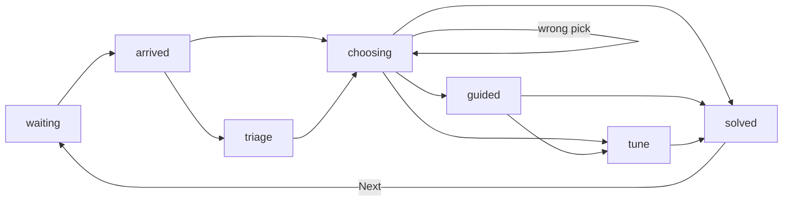

# Game logic: the engine from start to finish

This file says how the game engine works: what it remembers, what the player can do, and the exact order things happen in. It is the plan for `game/reducer.ts` and `game/types.ts`.

It holds no rules or numbers of its own. Prices, payouts, penalties, texts and the play order live in the other docs. This file points to them like this: (see GAME_DESIGN.md > Money). The check script makes sure every pointer leads to a real heading.

Where the rules do not yet say what the engine should do, this file says "Open question" and gives it a number. The questions and the proposed answers are at the end. Until you answer one, build the proposed answer and list it in PROGRESS.md.

## How to read this file

- **State** is everything the engine remembers. It is saved after every change.
- **Derived** values are worked out from the state each time. They are never saved.
- **Actions** are the only way the state changes. Each one is a player tap or a timer.
- Every incident, email, option and item is looked up by its id in the data files. The engine never has a single incident written into it.

## Three rules for the save

The game will keep growing, so a save must survive new incidents, new rules and fixed typos.

1. **Save ids, never text.** An email is saved as a key such as `request:feat-photos`, and its words are looked up in the data files each time it is shown. A fixed typo then shows up in old saves too.
2. **Save the place as an incident id, never a row number.** New incidents can be added anywhere in the play order without moving anyone.
3. **Carry old saves forward.** Each change to the save format comes with a migration that upgrades an older save by one version. A fresh game is only ever started when a save cannot be read at all.

---

# Part 1: What the engine remembers

## The game state

| Field | What it holds | At the start |
|---|---|---|
| `saveVersion` | The version of the save format | The current version |
| `seed` | A random number picked once. It fixes every shuffle, so cards keep their places after a reload | A new random number |
| `currentId` | The id of the current incident, such as `2.4` | The first id in the play order (see GAME_DESIGN.md > Play order) |
| `phase` | Where the current incident is. See "The life of one incident" | `waiting` |
| `run` | Everything about the current incident attempt. See the next table | A fresh run |
| `users` | Users earned for good. Outage dips are not taken off here | 0 |
| `cash` | Pounds in the bank. Never below 0 | £0 (see GAME_DESIGN.md > Money) |
| `loanOwed` | Pounds still owed to the investor | £0 |
| `topUps` | How many investor top-ups have happened | 0 |
| `owned` | Ids of Shop items bought | None |
| `lifeline` | The stage in which the held lifeline was bought, or none (see UPGRADES.md > Victor's lifeline) | None |
| `emails` | Every email sent, in order, as a key and a read flag. See "Email keys" | None |
| `recycleBin` | Every wrong choice tried, as an incident id and an option id, card or wrong move | None |
| `results` | For each solved incident id: its final stars, and whether it was solved first try (see GAME_DESIGN.md > Solved first try) | None |
| `refreshersDue` | Ids of repeats whose refresher is waiting to be sent | None |
| `standbyStages` | Stages in which the Standby server has already saved an outage | None |
| `blueprints` | Each finished Build id, with the arrows the player drew | None |
| `tutorial` | The tutorial step, or "skipped" or "done" | Step 1 |
| `tipsSeen` | Which first-time tips have been shown | None |
| `settings` | Text size, motion, sound, wallpaper | Defaults |
| `won` | True once the final incident is solved | False |

Window positions and which windows are open are screen state, not game state. They are not saved. Closing a window never changes the game state.

## The run: one incident attempt

A fresh run is made each time a new incident becomes current.

| Field | What it holds |
|---|---|
| `stars` | Starts at 3. Never below 1 (see GAME_DESIGN.md > Stars) |
| `tried` | Options or cards the player picked that were wrong |
| `removed` | Options taken away by upgrades |
| `calls` | How many calls to Dana were made. Any call, free or not, spoils first try |
| `handbookUsed` | Whether the free call from the Engineering handbook was used |
| `lifelineUsed` | Whether Victor's lifeline was used. It spoils first try |
| `testUsed` | Whether "Test first" was used. In a Build, whether the next deploy is the test |
| `dip` | Users lost to an outage in this incident. Given back when it is solved |
| `failedDeploys` | Build only: how many real deploys failed. A test deploy does not count |
| `canvas` | Build only: parts placed, arrows drawn, parts locked by calls, and whether the decoys were removed |
| `triageTaps` | Triage only: lines tapped, in order |
| `tuneWaves` | Tune only: the stop set for each wave, and whether it was right |
| `paid` | Cash lost to penalties and spent on calls in this incident, for the Stats window |

## Email keys

Each email is saved as a key. The key says what the email is, and the words come from the docs.

| Key | The email | Its words come from |
|---|---|---|
| `arrive:<incident id>` | How an incident arrives, when it is an email | Its "Arrives by" line |
| `request:<item id>` | A request email | (see UPGRADES.md > Request emails) |
| `thanks:<incident id>` | A thank-you email | (see GAME_DESIGN.md > Other emails (exact text)) |
| `opener:<stage>` and `opener:win` | Maya's stage opening and win emails | (see GAME_DESIGN.md > Stage opening emails (Maya)) |
| `other:<stage>` | Another start-of-stage email | (see GAME_DESIGN.md > Other emails (exact text)) |
| `refresher:<repeat id>` | A refresher about that repeat's pattern | (see GAME_DESIGN.md > Refreshers) |

A customer email shows the name given to its incident or item (see GAME_DESIGN.md > Customer names). A key that no longer points to anything is hidden, not shown blank.

## Derived values

| Value | How it is worked out |
|---|---|
| Current stage | The stage of the current incident. After the win, Stage 5 |
| Users on screen | `users` minus `dip`. The progress bar uses this number (see GAME_DESIGN.md > Progress bar) |
| Shop items on show | Items whose stage is at or below the current stage (see UPGRADES.md > Upgrades: the Shop) |
| Needed next | The current incident's "Needs" feature, if it is not owned |
| Can buy | On show, not owned, and either `cash` is at least the price or the item is Needed next |
| Calls in this incident | New or repeat: the Nudge plus each Clue line. Build: 2, plus one for each Tray part other than the "Call 1 places" part |
| Next call price | (see GAME_DESIGN.md > Consultant calls). £0 if the incident is 1.1, or if the Engineering handbook is owned and `handbookUsed` is false |
| Options still showing | The incident's options, minus `removed`, minus `tried` |
| Shuffled order | Options, cards, log lines and tray parts are shuffled using `seed` and the incident id. The same save always shows the same order |
| Pattern Book | Worked out from `results`. A solved new incident adds its pattern. A solved repeat fills a pip, gold if solved first try, and adds its "Also seen as" line. A solved Build adds "Built in" lines |

## Loading a save

1. If the save is an older version, run its migrations one at a time until it is current.
2. If `currentId` is still in the play order, carry on from there.
3. If `currentId` was removed from the play order, the current incident becomes the first incident in the play order with no entry in `results`.
4. Incidents added to the play order before `currentId` are not played on this save.
5. Results, emails and Recycle Bin entries for ids that no longer exist are ignored.

---

# Part 2: The life of one incident

## Phases

Every incident moves through these phases in this order. Some phases are skipped, as the table says.

| Phase | What is happening | Skipped when |
|---|---|---|
| `waiting` | The incident's "Needs" feature is not owned yet. Nothing has arrived | The incident needs nothing, or the feature is owned |
| `arrived` | The alert or email from "Arrives by" is showing. The Incident icon has a red badge | Never |
| `triage` | Terminal is open with the six log lines | The incident has no Triage step |
| `choosing` | The diagram, Maya's line and the options or cards are showing. In a Build, Blueprint is open | Never |
| `guided` | Only the right answer is left. Its Result sentence shows and the player taps to apply it | The player finds the answer before it comes to this |
| `tune` | SysDash is open with the dial and three waves | The incident has no Tune step |
| `solved` | Rewards are shown: users, cash, stars, the new pattern or pip | Never |

Then the player taps "Next", the after-solve steps run, and the next incident starts at `waiting`.

The flows these phases follow are in GAME_DESIGN.md (see GAME_DESIGN.md > New incident flow: teach before testing), (see GAME_DESIGN.md > Repeat incident flow: recall, not recognition) and (see GAME_DESIGN.md > Build incident flow: draw the design).

## When the run starts

When an incident becomes current:

1. Make a fresh run.
2. Remove options that owned upgrades take away. These are the "Removed by" lines (see CHALLENGES.md > How to read an incident). Only new incidents lose options this way. If an upgrade removed something, queue Maya's line from that item's effect text.
3. If the incident needs a feature that is not owned, stay in `waiting`. The Shop shows the feature as Needed next. Otherwise move to `arrived`.

Upgrades bought after this point do not change this incident (see GAME_DESIGN.md > The Shop in brief).

---

# Part 3: Player actions

| Action | Allowed when | What it changes |
|---|---|---|
| Investigate | Phase is `arrived` | Moves to `triage`, or to `choosing` if there is no Triage step. Marks the incident's email as read |
| Tap a log line | Phase is `triage` | Adds it to `triageTaps`. Cause: move to `choosing`. Symptom or routine: grey it out and show its message (see GAME_DESIGN.md > Triage, in Terminal) |
| Pick an option or card | Phase is `choosing`, and it is still showing | See "Picking" below |
| Test first | `srv-test` owned and not used yet in this run | New incident or repeat: shows one option's result and changes nothing else (see UPGRADES.md > Rules when effects combine). Build: makes the next deploy a test. See "Deploying" |
| Call Dana | Phase is `choosing`, `calls` is below the calls in this incident, and `cash` is at least the next call price | See "Calls" below |
| Use Victor's lifeline | Phase is `choosing`, every call in this incident is made, and `lifeline` is the current stage | See "Calls" below |
| Remind me | A repeat, phase is `choosing` | Nothing. The screen shows the card's "Use this when" line |
| Place, move or remove a part | A Build, phase is `choosing` | Changes `canvas`. Parts locked by calls cannot be moved or removed |
| Draw or delete an arrow | A Build, phase is `choosing` | Changes `canvas` |
| Deploy and test | A Build, phase is `choosing` | See "Deploying" below |
| Apply the guided answer | Phase is `guided` | Moves to `tune`, or to `solved` if there is no Tune step |
| Set the dial and run a wave | Phase is `tune` | Records the wave. After the third wave, moves to `solved` |
| Next | Phase is `solved` and the game is not won | Runs the after-solve steps |
| Buy | The item can be bought | See "Money" below |
| Buy Victor's lifeline | `lifeline` is none and `cash` is at least its price for the current stage | Takes the price from `cash`. Sets `lifeline` to the current stage |
| Open an email | Any time | Marks it as read |
| Tutorial step, skip or replay | Any time | Changes `tutorial` |
| Change a setting | Any time | Changes `settings` |
| Reset game or Play again | After the confirm step | A fresh state, keeping `settings` (see GAME_DESIGN.md > Saving) |

The Shop, Inbox, Pattern Book and every other window can be opened in any phase (see GAME_DESIGN.md > The Shop in brief).

## Picking

**In a new incident**, by the option's type (see GAME_DESIGN.md > Option types in new incidents):

- **best:** show its Result. Move to `tune`, or to `solved`.
- **partial:** take 1 star. Take the partial cash penalty. Add the option to `tried` and to the Recycle Bin. Show the Result.
- **bad:** take 1 star. Take the bad cash penalty and set `dip`, both changed by Monitoring (see UPGRADES.md > Servers). If the Standby server is owned and the current stage is not in `standbyStages`, there is no dip: add the stage to `standbyStages` and show Maya's Standby line. Add the option to `tried` and to the Recycle Bin. Show the Result.

**In a repeat**:

- **right card:** show its Result with the "Seen before" stamp. Move to `tune`, or to `solved`.
- **wrong card:** take 1 star. No cash is lost and there is no dip. Add it to `tried` and to the Recycle Bin. Show its "Why not" line.

**After any wrong pick:** if only the right answer is still showing, move to `guided`. Nothing else is shown. Clues only come from calls.

## Calls

**Call Dana** (see GAME_DESIGN.md > Consultant calls):

1. Work out the next call price. Take it from `cash` and add it to `paid`. If the handbook made it free, set `handbookUsed` to true.
2. Add 1 to `calls`.
3. New incident or repeat: show the clue for this call number. Call 1 is the Nudge, call 2 is Clue 2, call 3 is Clue 3.
4. Build (see GAME_DESIGN.md > Calls in a Build): call 1 places and locks the "Call 1 places" part and shows the Nudge. Call 2 removes every decoy from the tray and the canvas, with any arrows joined to them. Each later call places and locks the next Tray part that is not locked yet.
5. Stars do not change.

**Use Victor's lifeline** (see UPGRADES.md > Victor's lifeline):

1. Set `lifeline` to none and `lifelineUsed` to true.
2. New incident or repeat: move to `guided`.
3. Build: draw the Solution and move to `guided`.
4. Stars do not change.

When a new stage starts, set `lifeline` to none if it was bought in an earlier stage.

## Deploying

1. If the arrows on the canvas are exactly the Solution, the design is right. Parts with no arrows do not count (see GAME_DESIGN.md > When a design is right).
2. Otherwise, go through the Build's wrong moves in the order they are written (see BLUEPRINTS.md > How to read a Build). The first one that applies is shown. If none applies, show the general failure.

**A test deploy** is the deploy after the player taps "Test first" in Blueprint (see UPGRADES.md > Rules when effects combine).

- If the design is right, show its Result with the words "This would work", the same as Test first anywhere else (see UPGRADES.md > Rules when effects combine). The player then deploys for real.
- If it fails, show the failure. No star is lost. It does not count toward the two failed deploys, does not spoil first try and does not go in the Recycle Bin.

**A real deploy:**

- If the design is right, save the arrows in `blueprints` and move to `solved`.
- If it fails, take 1 star. Add 1 to `failedDeploys`. Add the wrong move, if one applied, to the Recycle Bin (see GAME_DESIGN.md > Build incident flow: draw the design). The canvas stays as it is.
- After the second failed real deploy, draw the Solution and move to `guided`.

## First-time tips

Each tip is tied to a moment, such as the first server alert (see GAME_DESIGN.md > First-time tips).

- The first time that moment happens, show the tip if it is not in `tipsSeen`, then add it to `tipsSeen`.
- Never show a tip while a tutorial step is showing. Wait until the step is done.
- Skipping the tutorial does not skip the tips.

---

# Part 4: Money and users

## Cash coming in

When an incident is solved, work out its pay in this order (see GAME_DESIGN.md > Money):

1. Base cash for the stage, halved for a repeat.
2. Times the star multiplier for the run's final stars.
3. Plus the Triage bonus, if the cause was the first line tapped.
4. Plus the Tune bonus for each wave set right.
5. Times 1.1 if the Faster PC is owned.
6. Round once, to the nearest whole pound.

Triage and Tune bonuses are paid here, with the rest of the pay, not the moment they are earned.

All cash coming in pays the loan first: the smaller of the pay and `loanOwed` comes off `loanOwed`, and the rest goes into `cash`.

## Cash going out

- **Penalties:** taken from `cash`, rounded to whole pounds. `cash` stops at £0. Penalties never add to the loan.
- **Calls and lifelines:** taken from `cash`. They can only be bought when `cash` covers them, so they never add to the loan.
- **Buying:** the price comes off `cash`. The item goes into `owned`. Its "Users gained" are added to `users` at once (see UPGRADES.md > Upgrades: the Shop). If it is the feature the current incident is waiting for, move that incident to `arrived`.

## The investor top-up

This only happens when the player buys the feature that is Needed next and `cash` is below its price (see GAME_DESIGN.md > The game must never get stuck):

1. Add the shortfall to `loanOwed`. Add 1 to `topUps`. Show Maya's investor line.
2. Buy the feature as normal. `cash` ends at £0.

The loan never passes through `cash` on its own, so it cannot be spent on anything else.

## Users

- Solving an incident adds its "Users gained" to `users` and sets `dip` back to 0.
- An outage sets `dip` to a share of the users on screen at that moment.
- The player wins when the final incident in the play order is solved, not when a number is reached (see GAME_DESIGN.md > Users).

## When an incident is solved

1. Store the run's `stars`, and whether it was solved first try, in `results`. First try means `tried` is empty, `failedDeploys` is 0, `calls` is 0 and `lifelineUsed` is false (see GAME_DESIGN.md > Solved first try).
2. The Pattern Book and pips change by themselves, because they are worked out from `results` (see GAME_DESIGN.md > Pips and mastery).
3. A repeat that was not solved first try is added to `refreshersDue` (see GAME_DESIGN.md > Refreshers).
4. Pay cash and add users, as above.

---

# Part 5: Between incidents

## After the player taps Next

Run these in order. Each email shows its own balloon, one after another (see GAME_DESIGN.md > The order emails arrive in).

1. **Thank-you email**, if the incident came from a customer, Sam, Lena, Omar or Zoe (see GAME_DESIGN.md > Other emails (exact text)).
2. **Refresher emails** that are now due.
3. **Request emails** whose "Arrives" names the incident just solved (see UPGRADES.md > Request emails). Skip any for items already owned (see UPGRADES.md > Request emails).
4. Set `currentId` to the next id in the play order.
5. **If the stage has changed:** drop an unused lifeline from an earlier stage. The new stage's room clips play first (see ROOM.md > When a new stage starts). Then Maya's stage opening email. Then request emails that arrive at the start of this stage. Then any other email for the start of this stage. Then the "New in the Shop" balloon.
6. **Start the next incident** (see "When the run starts").

## The start of the game

1. Make a fresh state with a new `seed`.
2. Play the room intro and wait for the player to sit down (see ROOM.md > The first time the game is opened). Then show the BlipOS loading bar (see UI_THEME.md > Desktop).
3. Send Maya's Stage 1 opening email.
4. Start the first incident. Its email arrives and the tutorial begins (see GAME_DESIGN.md > Tutorial).

## The end of the game

When the final incident is solved, set `won` to true and show the win screen instead of "Next" (see GAME_DESIGN.md > Win screen). Send Maya's win email. Everything on the win screen is worked out from `results`, `users`, `cash`, `loanOwed` and `topUps`.

## Saving

Save the whole state after every action (see GAME_DESIGN.md > Saving). Follow "Three rules for the save" at the top of this file.

---

# Part 6: Worked examples

Each example is one incident traced with exact numbers. Each one should become a test for the reducer. "Cash before" is made up for the example.

## Example 1: 1.1 The Open Door, the tutorial

- Cash before £0. No upgrades.
- The player picks the best option first.
- Stars 3. Pay: £500 x 1.5 = £750. Cash after £750.
- Users 0 to 200. First try: yes. Pattern Book gains RBAC with pip 1 gold.
- It came from Maya, so there is no thank-you email. Next sends `request:srv-test`, then 1.2 arrives as a server alert and the first-alert tip shows.

## Example 2: 2.1 The Melting Database, with Triage and a wrong pick

- Cash before £1,000. No upgrades, so the bigger-server option is still showing.
- Triage: the player taps the cause first. Triage bonus earned.
- The player picks "Buy a bigger database server" (partial). Stars 3 to 2. Penalty 20% of £2,000 = £400. Cash £600. No clue is shown.
- The player picks the best option.
- Pay: £2,000 x 1 = £2,000, plus Triage bonus 10% of £2,000 = £200. Total £2,200. Cash after £2,800.
- Users +9,000. First try: no. Caching is learned with pip 1 gold, because pip 1 is always gold.

## Example 3: R7 The Trending Crush, a repeat with Tune and the Faster PC

- Faster PC owned. Caching already has pip 1 from 2.1 and pip 2 from R3.
- The player picks Sharding (wrong). Stars 3 to 2. No cash lost, no dip.
- The player picks Caching. Tune: 2 of 3 waves right.
- Pay: £50,000 / 2 x 1 = £25,000. Tune bonus 2 x 5% of £50,000 = £5,000. Subtotal £30,000. Faster PC: x 1.1 = £33,000.
- Users +15,000,000. First try: no, so Caching's pip 3 is silver and R7 goes into `refreshersDue`.
- Next sends `thanks:R7` from Sam. The refresher is sent after 4.3 is solved.

## Example 4: Standby and Monitoring in Stage 3

- Monitoring and Standby server owned. `standbyStages` is empty. Users on screen 4,000,000.
- In 3.2 the player picks "Make logins last much longer" (bad). Stars 3 to 2. Cash loss is halved: 5% of £10,000 = £500. Standby saves the outage: no dip, Stage 3 goes into `standbyStages`, and Maya says her Standby line.
- Later in 3.3 the player picks "Keep retrying the email instantly" (bad). Stage 3 is already in `standbyStages`, so this one dips: 5% of the users on screen at that moment. Cash loss £500.
- Each dip is given back when its incident is solved.

## Example 5: the investor top-up for Email notifications

- Cash £5,000. Loan £0. 3.3 is waiting for `feat-email`, which costs £8,000.
- The player taps Buy. The shortfall is £3,000. `loanOwed` becomes £3,000, `topUps` becomes 1, Maya says her investor line.
- The feature is bought. Cash £0. Users +1,500,000. 3.3 moves to `arrived`.
- 3.3 is solved with 3 stars. Pay £10,000 x 1.5 = £15,000. £3,000 pays off the loan. Cash after £12,000.

## Example 6: B2 The Fast Front Page, with Test first and two calls

- Cash before £1,000. Test environment owned. Engineering handbook not owned.
- The player calls Dana. Price 15% of £2,000 = £300. Cash £700. The Cache is placed and locked, and Dana says the Nudge.
- The player taps "Test first", draws Web server to Database, and deploys. It is a test deploy: the wrong move about the cache shows, no star is lost, and `failedDeploys` stays 0.
- The player calls again. Price 25% of £2,000 = £500. Cash £200. The One big server decoy is removed. Stars stay at 3. First try is now spoiled.
- The player deploys the right design. Pay £2,000 x 1.5 = £3,000. Cash after £3,200. Users +10,000.
- Caching and CDN each gain a "Built in" line. Next sends `thanks:B2` from Zoe.

## Example 7: 4.2 The Table That Got Too Big, with the handbook and Victor's lifeline

- Engineering handbook owned. Earlier in Stage 4 the player bought Victor's lifeline for £100,000, so `lifeline` is 4. Cash £50,000 when 4.2 arrives.
- 4.2 has three calls: the Nudge, Clue 2 and Clue 3. Call 1 is free with the handbook. Call 2 costs 25% of £50,000 = £12,500. Call 3 costs 35% = £17,500. Cash £20,000.
- Still unsure, the player uses the lifeline. `lifeline` becomes none. The incident moves to `guided` and the player applies the answer.
- Stars 3. Pay £50,000 x 1.5 = £75,000. Cash after £95,000. First try: no.
- The calls and the lifeline cost £130,000 and the incident paid £75,000, so the help cost more than it earned.

---

# Open questions

When a question comes up, add a row here with a proposed answer. When you decide, the answer moves to its home, usually GAME_DESIGN.md, and the question is removed from here.

| # | Question | Proposed answer |
|---|---|---|
